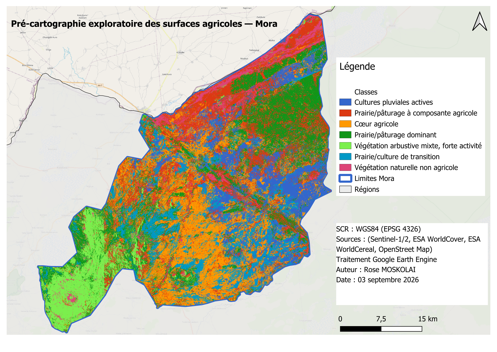

# Pré-cartographie des surfaces agricoles par télédétection — Zone pilote de Mora

**Contexte professionnel** : ce projet s'inscrit dans le cadre du **Recensement Général de l'Agriculture et de l'Élevage (RGAE)** du Cameroun, pour la cartographie des surfaces agricoles dans les zones difficiles d'accès (contraintes sécuritaires et logistiques), en s'appuyant sur la méthodologie [EOSTAT de la FAO](https://www.fao.org/in-action/eostat/en).

> Ce dépôt documente la mise en œuvre pilote sur l'arrondissement de **Mora** (région de l'Extrême-Nord), premier des quatre sites ciblés par le RGAE (Mora, Bamenda I, Buea, Fongo-Tongo).

## Objectif

Produire une **pré-cartographie exploratoire des surfaces agricoles** à partir de séries temporelles Sentinel-1 (radar) et Sentinel-2 (optique), sans dépendre exclusivement d'enquêtes de terrain — une approche essentielle dans les zones où le déploiement classique d'équipes de recensement est limité.

## Approche méthodologique

1. **Fusion multi-capteurs** : combinaison Sentinel-1 (SAR, insensible à la nébulosité) et Sentinel-2 (optique, riche en information spectrale) pour compenser les limites de chaque source, particulièrement critique en zone sahélienne en saison des pluies.
2. **Analyse de séries temporelles** : construction de 28 fenêtres temporelles de 15 jours sur un cycle complet (avril 2025 – mai 2026), couvrant à la fois la campagne agricole pluviale et la campagne de contre-saison (*muskuwaari*, sorgho de décrue typique de l'Extrême-Nord).
3. **Classification non supervisée** (K-means, k=7) en l'absence de données d'entraînement labellisées exhaustives — conforme au scénario "données limitées" de la méthodologie EOSTAT.
4. **Validation croisée avec des sources publiques** : [ESA WorldCover](https://esa-worldcover.org) (occupation du sol, 10m) et [ESA WorldCereal](https://esa-worldcereal.org) (cultures actives par saison, 10m), toutes deux sous licence CC-BY-4.0 — permettant une interprétation des clusters entièrement reproductible, sans dépendance à des données de recensement gouvernemental.

Le détail complet de la méthodologie de référence (RGAE/EOSTAT) est résumé dans [`docs/METHODOLOGY_SUMMARY.md`](docs/METHODOLOGY_SUMMARY.md).

## Stack technique

| Outil | Usage |
|---|---|
| **Google Earth Engine** (JavaScript API) | Collecte, prétraitement, fusion temporelle, clustering |
| **QGIS** | Définition de la zone d'étude, données auxiliaires, contrôle qualité spatial, mise en page |
| **Python** (pandas, GDAL) | Analyse des croisements, conversion de formats |
| **ESA WorldCover / WorldCereal** | Sources de validation publiques (occupation du sol, cultures actives) |

## Ce que montre ce dépôt

- Un **pipeline GEE complet et reproductible** ([`scripts/01_pipeline_mora.js`](scripts/01_pipeline_mora.js)), depuis la collecte brute jusqu'au clustering et à l'export.
- Un processus de **débogage réel documenté** : gestion des fenêtres temporelles sans données (nébulosité persistante), erreurs de typage GEE (`MaskOnly` vs `Float`), limites de calcul (`maxPixels`), diagnostic d'artefacts de nébulosité résiduelle — voir [`docs/FINDINGS.md`](docs/FINDINGS.md).
- Une **démarche de validation honnête** : le test d'une hypothèse spécifique (détection du signal phénologique de la culture de contre-saison *muskuwaari*) qui n'a **pas été confirmée** aux échelles d'agrégation testées — documenté comme limite plutôt que masqué, avec les pistes d'investigation identifiées pour la suite.

## Résultat final — Mora



**Légende interprétée** (croisement des 7 clusters K-means avec ESA WorldCover et ESA WorldCereal — voir [`docs/FINDINGS.md`](docs/FINDINGS.md) pour le détail des pourcentages) :

| Classe | Base de l'interprétation |
|---|---|
| Cultures pluviales actives | 45% Cultures WorldCover, 98% actif WorldCereal (le plus élevé) |
| Prairie/pâturage à composante agricole | 61% Prairie, 19% Cultures |
| **Cœur agricole** | 64% Cultures — cluster le plus franchement cultivé |
| Prairie/pâturage dominant | 71% Prairie, 21% Cultures |
| Végétation arbustive mixte, forte activité | 62% Prairie + 18% Arbustes + 5% Arbres, mais 94% actif |
| Prairie/culture de transition | 70% Prairie, 28% Cultures |
| **Végétation naturelle non agricole** | 66% Arbustes/Arbres, activité la plus faible (73%) — correspond à la zone de piedmont des monts Mandara (sud-ouest) et à une bande de végétation naturelle (nord) |

## Statut

✅ **Pilote Mora complété** — pipeline GEE (collecte, fusion S1/S2, clustering K-means), validation croisée avec sources publiques (WorldCover, WorldCereal), carte finale interprétée et mise en page QGIS.

🔶 **Prochaines étapes** : extension aux 3 autres zones RGAE (Buea, Fongo-Tongo, Bamenda I), avec paramètres recalibrés par zone (périodes de collecte, seuils de nébulosité — Buea nécessitera une attention particulière à la nébulosité équatoriale).

## Structure du dépôt

```
├── scripts/
│   └── 01_pipeline_mora.js       # Pipeline GEE complet et commenté
├── docs/
│   ├── METHODOLOGY_SUMMARY.md    # Résumé de la méthodologie RGAE/EOSTAT
│   └── FINDINGS.md               # Journal de bord technique : résultats, diagnostics, décisions
├── results/
│   └── figures/                  # Captures et graphiques générés (NDVI, VV, clusters, profils temporels)
└── README.md
```

## Auteur

**Rose Moskolai** — Responsable régionale des Affaires Générales et des Systèmes d'Information, MINEPIA (Cameroun). Doctorat en informatique, spécialisation SIG, télédétection et analyse spatiale.

---

*Ce projet a été développé dans un contexte professionnel réel (appui méthodologique au RGAE) et est partagé ici à des fins de démonstration technique.*
